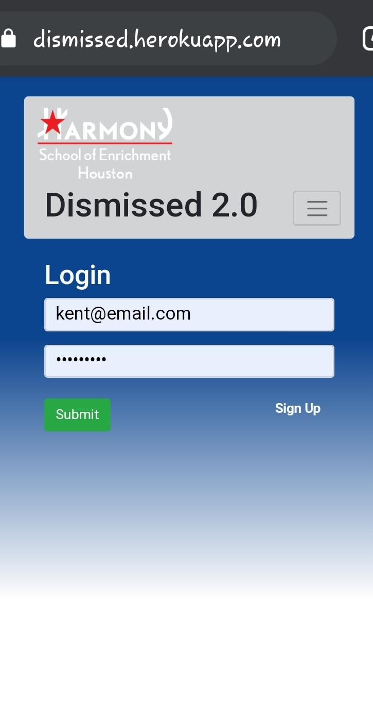

# Dismissal 

An open source school dismissal application.
Deployed to [Heroku](https://dismissed.herokuapp.com/)
___

The purpose of this project to help solve congestion issues with general school dismissals. 

In an earlier group project, my team and I set out to tackle this very issue. We came up with [Dismissed](https://github.com/margosij/Project-3), a school dismissal manager. However, that previous project didn't completely solve the issue at hand. One goal it did achieve was that it eliminated the need to have teachers outside manually entering in names, the parents did that.

Unfortunately, it did not solve the congestion issue. So, this will be a complete redesign from the ground up with a more **focused** aim on solving the congestion issue. 

### Technologies used: (so far)
- React
- Redux
- JavaScript ES6
- Express
- Nodejs
- Passport
- Bcrypt
- Reactstrap
- Validator
- Socket.io
- MongoDB
- Heroku
- Axios

# Summary

## Whats the specific problem? 
  - An elementary charter school of 600+ students sits on a cramp campus with two other schools with just as many students. With no buses, dismissal is a mess and the congestion backs up for miles.
  
- ### What is the current system or solution?
  - A group messaging app that will remain unnamed.
- ### Why is this not working?
  - Teachers and admins stand outside in the elements, whether hot, cold, raining, and/or snowing, and type in **every ***single*** name**. 
    - #### What's wrong with that?
      - tiresome
      - time-consuming
      - redundant
      - burns through cell phones
      - Sometimes parents are there to pickup more than one student which causes confusion and even more typing.
  

## What will be different this time?
- TDD - **I cannot stress this enough**.
- Different UI
- More in-depth components
- Maybe Chat, or more so one-way communication from teacher to parent.
- Maybe split the app in 2
# Expected Release in June 2020

### TODOS:
1. implement unit testing
2. validate the token in your server-side logic by using something like express-jwt, koa-jwt, Owin Bearer JWT, etc.
